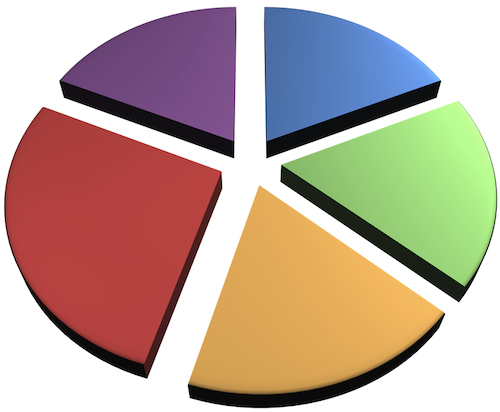

# FairShare - einfach "fairteilen"

## https://kommitment.github.io/fairshare/

Bei FairShare geht es um die faire Verteilung der Anteile eines Unternehmens.

### Lizenz 

[FairShare](https://github.com/kommitment/fairshare) von [kommitment GmbH & Co. KG](https://kommitment.works) ist lizenziert unter der [Creative Commons 4.0 International Lizenz](http://creativecommons.org/licenses/by-sa/4.0/) (Weitergabe unter gleichen Bedingungen).

